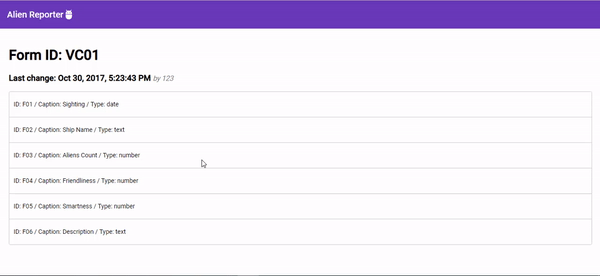

# AlienReport

## Tools Used

This project was created using Angular CLI.
Angular version: 7.1+
NPM: 6.4.1
Node.js: 8.11.3

I created the reporting.component using the Angular Material CDK.

Styles: Bootstrap 4 and Material Design.

## Running the application

After downloading you need run `npm install` to install all dependecies.

Run `ng serve --open` to see the app running. Navigate to `http://localhost:4200/`. The app will automatically reload if you change any of the source files.

I hope you enjoy it.

Best regards, Allan.
